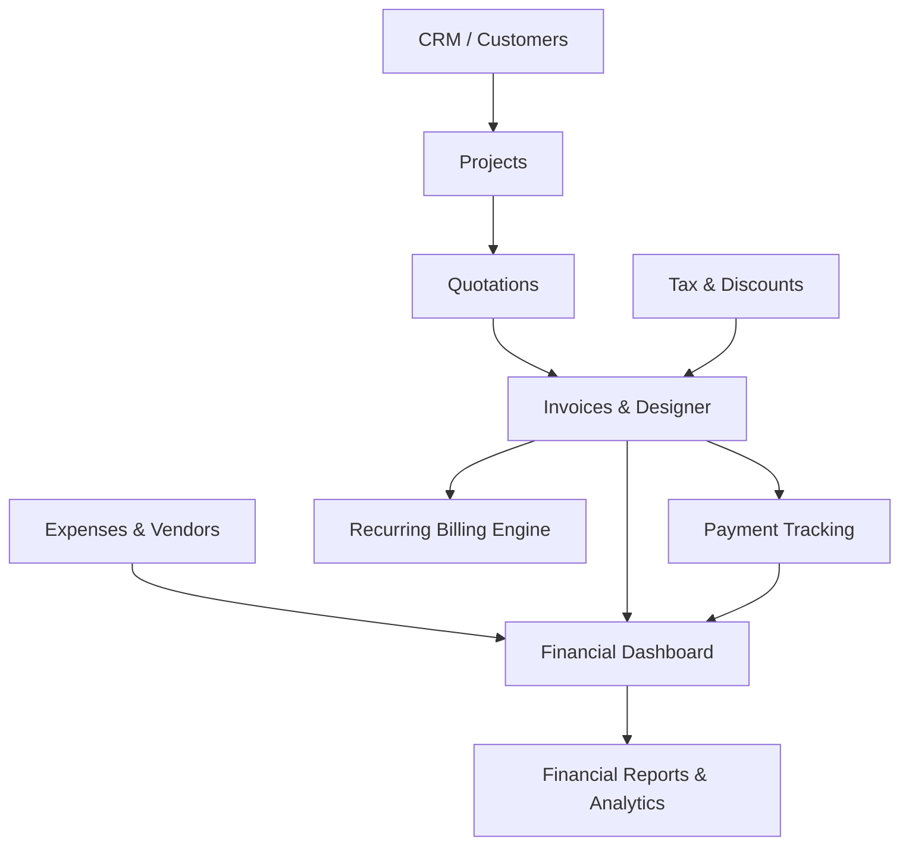

# AVEX CRM - Financial Module Documentation

---

## Executive Overview

The **AVEX CRM Financial Module** is an enterprise-grade financial management system providing complete end-to-end visibility into company revenues, invoicing, quotations, payment collections, expense management, tax & discount configurations, recurring billing automation, and executive reporting.

---

## System Architecture & Submodules



### Core Submodules

1. **Invoice Management & Invoice Designer (`/invoices`, `/invoices/templates`)**:
   - Status tracking (`DRAFT`, `SENT`, `VIEWED`, `PAID`, `PARTIALLY_PAID`, `OVERDUE`, `CANCELLED`).
   - Dynamic Layout Designer with corporate theme presets (`CLASSIC`, `MODERN`, `MINIMAL`, `PROFESSIONAL`), live branding preview, font selectors, and customizable column visibility.

2. **Quotation System (`/quotations`)**:
   - Custom quotation creation with version control, client approval workflows, and instant conversion to draft invoices upon acceptance.

3. **Payment Tracking (`/payments`)**:
   - Partial & full payment recording with multiple payment methods (Bank Transfer, Credit Card, Cash, Check), collection rate analytics, and customer payment timelines.

4. **Expense Management (`/expenses`)**:
   - Expense categorization, receipt file attachments, approval workflows, vendor assignments, and project expense allocation.

5. **Tax & Discount Management (`/taxes`)**:
   - Tax rate templates (Inclusive/Exclusive tax calculation engines), percentage/fixed multi-rate discount rules, and soft-delete protection.

6. **Recurring Invoices & Automation (`/invoices/recurring`)**:
   - Automated recurring billing schedules (Daily, Weekly, Bi-Weekly, Monthly, Quarterly, Semi-Annually, Yearly, Custom).
   - Monthly Recurring Revenue (MRR) tracking and background generation job runner (`/api/invoices/recurring/process-jobs`).

7. **Financial Reports & Analytics (`/reports`)**:
   - 8 reporting domains: Revenue Analysis, Expense Analysis, Invoice Summary, Payment Collections, Profit & Loss, Tax Reports, Customer Financial Ranking, and Project Profitability.
   - Filtering, CSV file exports, print view, and scheduled report automation.

---

## Database Schema Models ([schema.prisma](file:///d:/Avex%20CRM/apps/web/prisma/schema.prisma))

- `CompanyBranding`: Stores logo, tax number, contact info, address.
- `InvoiceTemplate`: Layout styles, primary/secondary colors, fonts, column visibility flags.
- `Invoice`, `InvoiceItem`, `InvoicePayment`: Main financial transaction lifecycle tables.
- `Quotation`, `QuotationItem`, `QuotationVersion`: Sales proposal and quote conversion records.
- `ExpenseCategory`, `Vendor`, `Expense`: Operating expense tracking and vendor accounting.
- `TaxRate`, `TaxTemplate`, `Discount`, `DiscountRule`: Tax and pricing calculation rules.
- `RecurringInvoice`, `RecurringInvoiceItem`, `RecurringInvoiceHistory`: Subscription schedules & billing history.
- `SavedReport`, `ScheduledReport`: Report templates and cron schedule configurations.

---

## Background Automation Jobs

Background jobs can be triggered via cron or serverless workers at `POST /api/automation/run-all`:

```bash
curl -X POST http://localhost:3000/api/automation/run-all \
  -H "Content-Type: application/json" \
  -d '{"companyId": "comp_001"}'
```

---

## Multi-Tenant Security & Tenant Isolation

Every database query, API endpoint, and background job explicitly scopes records using `where: { companyId }`.
Access to financial routes is guarded via Role-Based Access Control (`canAccessRoute` in `rbac-matrix.ts`).

---

## Verification & Testing

- **TypeScript Typecheck**: `npx tsc --noEmit --project apps/web/tsconfig.json`
- **Vitest Test Suite**: `npm --prefix apps/web test` (45/45 passing unit tests)
